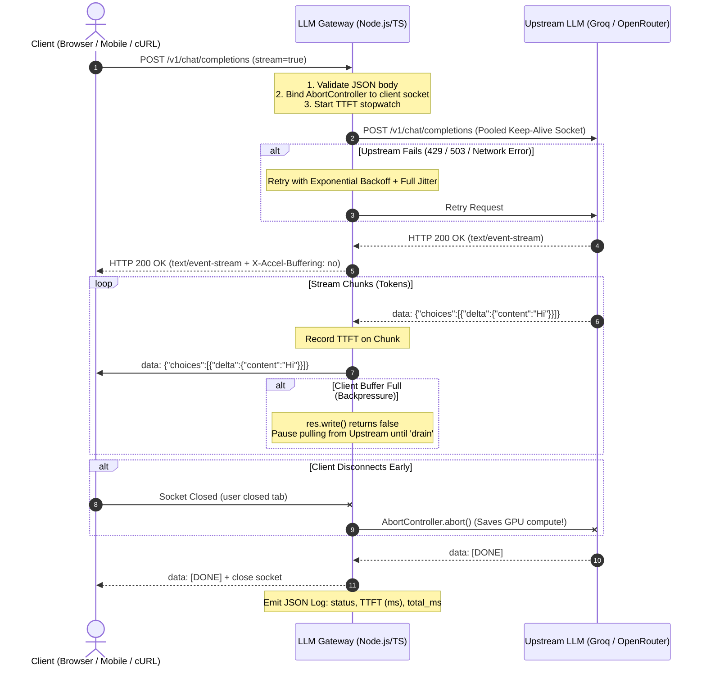

# High-Performance LLM Streaming Gateway

An ultra-reliable, production-grade reverse proxy built with **Node.js 20** and **TypeScript** that fronts OpenAI-compatible streaming endpoints (Groq, OpenRouter, OpenAI, vLLM, Ollama). 

This gateway is engineered specifically to master and showcase the core primitives of **AI Systems Engineering** and **High-Throughput Backend Networking**:
- **Zero-latency Server-Sent Events (SSE) passthrough**
- **Hardened stream backpressure** (protecting gateway memory from slow readers)
- **High-density HTTP keep-alive connection pooling**
- **Multi-layer timeout architecture** (Connect, Time-to-First-Token, Idle Read, and Total timeouts)
- **Automatic retries with Exponential Backoff and Full Jitter**
- **Idempotency and graceful shutdown with active connection draining**
- **Real-time telemetry tracking TTFT (Time to First Token), TPOT, and End-to-End latency percentiles (p50, p95, p99)**

---

## 🌟 Why Do We Need an LLM Gateway?

When building modern AI-powered applications, connecting your client frontend directly to upstream providers (like OpenAI or Groq) creates severe architectural, security, and scalability bottlenecks:

```
[ Traditional Anti-Pattern: Direct Client-to-Provider ]

  +-------------+      Direct API Call (Exposes API Keys)      +--------------------+
  | Web Browser | -------------------------------------------> | Upstream AI API    |
  | Mobile App  | <------------------------------------------- | (OpenAI/Groq/etc.) |
  +-------------+       No Retry / No Rate-Limit / OOM Risk    +--------------------+
```

```
[ Production Pattern: LLM Streaming Gateway ]

  +-------------+                      +----------------------------------+                      +--------------------+
  | Web Browser |  SSE Stream (Safe)   |       LLM STREAMING GATEWAY      |  Pooled HTTP/2 Conns | Upstream AI API    |
  | Mobile App  | <==================> | - Token streaming & Backpressure | <==================> | (Groq/OpenRouter)  |
  | Microservice|                      | - Circuit Breaker & Timeouts     |                      |                    |
  +-------------+                      | - TTFT / TPOT Telemetry          |                      +--------------------+
                                       | - Zero-downtime Graceful Drain   |
                                       +----------------------------------+
```

### Key Gateway Responsibilities:
1. **Security**: Centralizes secret management (your Groq/OpenRouter API key never touches client devices).
2. **Resilience**: Absorbs transient upstream errors (429 Rate Limits, 503 Overloaded) using automatic jittered retries and circuit breakers without interrupting users.
3. **Memory Safety (Backpressure)**: Prevents slow mobile clients from causing memory leaks on your gateway server by dynamically pausing data flow from the GPU server.
4. **Cost Protection (Client Abort Passthrough)**: If a user closes their laptop or navigates away mid-generation, the gateway immediately cancels the upstream LLM generation, saving thousands of unused GPU output tokens.
5. **Observability**: Records precise latency breakdowns (**TTFT**, **TPOT**, **E2E**) across p50, p95, and p99 percentiles to monitor real user quality of experience.

---

## 📋 Architecture & Data Flow

Here is how a streaming request flows through this gateway:



---

## 🚀 Quick Start

### 1. Prerequisites
- **Node.js** `>= 20.0.0`
- **npm** `>= 10.0.0`
- A free API key from [Groq Cloud](https://console.groq.com) or [OpenRouter](https://openrouter.ai).

### 2. Installation & Setup
```bash
# Clone the repository
cd llm-gateway0

# Install dependencies
npm install

# Configure your environment variables
cp .env.example .env
```

Open `.env` and add your API credentials:
```env
PORT=3000
NODE_ENV=development
GROQ_API_KEY=gsk_your_actual_groq_api_key_here
```

### 3. Running the Gateway
```bash
# Start in development mode with hot-reloading (via tsx)
npm run dev

# Or build and run production bundle
npm run build
npm start
```
The server will boot on `http://localhost:3000`.

---

## 🧪 Testing the Streaming Endpoint

### Streaming Request via `curl`
Execute this in your terminal to see real-time token streaming:

```bash
curl -N -X POST http://localhost:3000/v1/chat/completions \
  -H "Content-Type: application/json" \
  -d '{
    "model": "llama-3.3-70b-versatile",
    "messages": [
      {"role": "user", "content": "Explain quantum computing in 3 short bullet points."}
    ],
    "stream": true
  }'
```

*(Note: The `-N` flag disables curl's output buffering, ensuring tokens render instantly onto your terminal as they arrive).*

### Sample Gateway Telemetry Output
For every request, the gateway outputs structured JSON telemetry:
```json
{"status": 200, "ttft_ms": 194, "total_ms": 1120}
```
- `status`: HTTP status from the upstream provider.
- `ttft_ms`: **Time To First Token** (194 milliseconds).
- `total_ms`: Total end-to-end stream lifespan (1.12 seconds).

---

## ⚡ Load Testing with k6 (500 Concurrent Streams)

To test how the gateway holds up under heavy production traffic, we use [k6](https://k6.io/).

### Running the 500-Stream Test
A complete load testing script is provided in [`k6-load-test.js`](file:///d:/WEB-dev/AI-INFRA/week1/llm-gateway0/k6-load-test.js).

```bash
# Run 500 virtual users (VUs) streaming concurrently for 1 minute
k6 run k6-load-test.js
```

### What to Look For:
1. **TTFT Percentiles**:
   - `p50` (Median user experience): should stay `< 300ms`.
   - `p95` (95th percentile under congestion): should stay `< 800ms`.
   - `p99` (Tail latency / worst 1% of users): measures socket queueing and thread pool starvation.
2. **Memory Stability**: Run `top` or check Task Manager. Node process memory should plateau and not climb continuously, proving **backpressure** is actively throttling over-buffered sockets.
3. **HTTP 502/504 Rates**: Should be `0%`.

---

## 📚 Complete Technical Deep Dive & Syllabus

If you want to understand **every single concept, term, formula, and failure mode** behind this system, please read our dedicated developer companion:

👉 **[Read DEVELOPER.md](file:///d:/WEB-dev/AI-INFRA/week1/llm-gateway0/DEVELOPER.md)**

Inside [DEVELOPER.md](file:///d:/WEB-dev/AI-INFRA/week1/llm-gateway0/DEVELOPER.md), you will find:
- **SSE vs WebSockets vs HTTP Chunked Transfer**: The exact mechanical breakdown and why LLM APIs standardized on SSE.
- **The Backpressure Disaster**: What happens to Node.js RAM when a client reads at 10 KB/s while a GPU produces at 500 KB/s.
- **Connection Pooling & Socket Limits**: How File Descriptor exhaustion (`EMFILE`) crashes gateways under high concurrency.
- **Multi-Tier Timeouts & Full Jitter Retries**: Why naive retries cause self-inflicted DDoS attacks ("Thundering Herds").
- **Graceful Shutdown & Connection Draining**: How to deploy new code without dropping a single active customer stream.
- **TTFT vs TPOT vs E2E**: How to measure and optimize the metrics that actually matter.
- **5 Hands-on "Self-Breaking Labs"**: Step-by-step experiments to deliberately break the server, observe the crashes, and verify the fixes.

---

## 🗺️ Engineering Roadmap

| Feature | Status | Primary File |
| :--- | :---: | :--- |
| **Strict Request Validation & Stream Forcing** | ✅ Implemented | [server.ts](file:///d:/WEB-dev/AI-INFRA/week1/llm-gateway0/src/server.ts) |
| **Early Client Abort Handling (`AbortController`)** | ✅ Implemented | [server.ts](file:///d:/WEB-dev/AI-INFRA/week1/llm-gateway0/src/server.ts) |
| **SSE Header Passthrough (`X-Accel-Buffering`)** | ✅ Implemented | [server.ts](file:///d:/WEB-dev/AI-INFRA/week1/llm-gateway0/src/server.ts) |
| **Per-Request TTFT & E2E Telemetry Logging** | ✅ Implemented | [server.ts](file:///d:/WEB-dev/AI-INFRA/week1/llm-gateway0/src/server.ts) |
| **Stream Backpressure Flow Control (`drain` event)** | 🔨 In Progress | [DEVELOPER.md §3](file:///d:/WEB-dev/AI-INFRA/week1/llm-gateway0/DEVELOPER.md#3-backpressure) |
| **HTTP Keep-Alive Connection Pool (`undici.Agent`)** | 🔨 In Progress | [DEVELOPER.md §4](file:///d:/WEB-dev/AI-INFRA/week1/llm-gateway0/DEVELOPER.md#4-connection-pooling) |
| **Multi-Tier Timeouts (Connect vs TTFT vs Idle)** | 🔨 In Progress | [DEVELOPER.md §5](file:///d:/WEB-dev/AI-INFRA/week1/llm-gateway0/DEVELOPER.md#5-timeouts-retries) |
| **Retry with Exponential Backoff & Full Jitter** | 🔨 In Progress | [DEVELOPER.md §5](file:///d:/WEB-dev/AI-INFRA/week1/llm-gateway0/DEVELOPER.md#5-timeouts-retries) |
| **Graceful Shutdown (`SIGINT`/`SIGTERM` Drain)** | 🔨 In Progress | [DEVELOPER.md §6](file:///d:/WEB-dev/AI-INFRA/week1/llm-gateway0/DEVELOPER.md#6-graceful-shutdown) |
